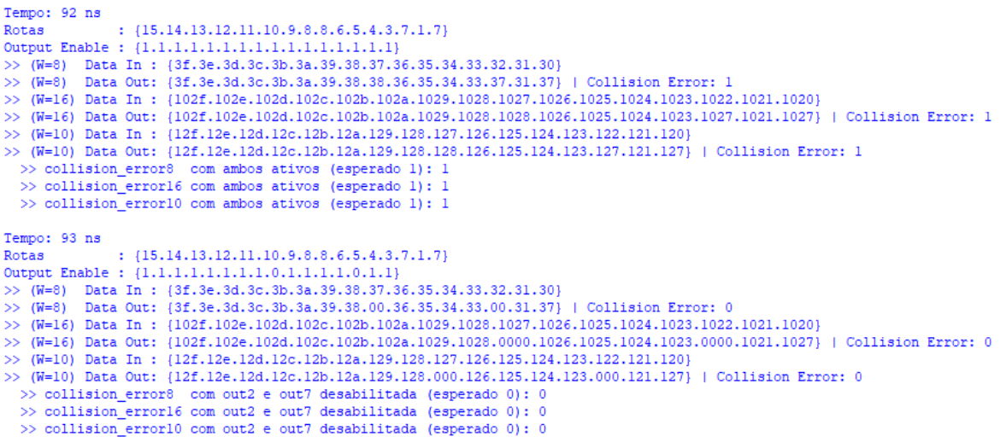

# Implementação Verilog

---

## `barrel_shifter.v` V0 - Controle

O módulo barrel shifter, de toração circular po palavras, de largura W sobre um vetor que contem N entradas.

### O que este módulo faz:

- A entrada `in`  é vista como N portas, cada um com W bits;
- O sinal `shift` define quantas posições esses blocos vão ser rotacionados circularmente.
- A saída `out`  é o mesmo conjunto de blocos, porém rotacionado, conforme o valor de shift.

A técnica usada é **duplicar** o vetor (`in_double = {in, in}`) para permitir selecionar uma “janela” contínua de N blocos.

### Entradas

- `in [N*W-1:0]` Vetor com N blocos de W bits conectados.
- `shift [$clog2(N)-1:0]` quantidade de rotação (0 até N-1, posições), em unidades de bloco. de bits

### Saída

- `out [N*W-1:0]` Quantidade de rotação (0 até N-1 posições), N possiveis possições, de um bloco de bits.

### Lógica

o bloco `k` de `out` recebe o bloco `(k + shift)` de `in` (com retorno circular).

## Testbench `barrel_shifter.v`

Entrada dos dados com N=8, para W=8, W=16, W=10 (sem ser potência de 2)

```verilog
    in8  = {8'h07, 8'h06, 8'h05, 8'h04, 8'h03, 8'h02, 8'h01, 8'h00};
    in16 = {16'h1007, 16'h1006, 16'h1005, 16'h1004, 16'h1003, 16'h1002, 16'h1001, 16'h1000};
    in10 = {10'h107, 10'h106, 10'h105, 10'h104, 10'h103, 10'h102, 10'h101, 10'h100};
```

Waves


Para W=10 usaremos a análise em binário


Terminal:

-- Caso 1: N=8, W=8 ---

in : 00 01 02 03 04 05 06 07

sh=0 | out : 00 01 02 03 04 05 06 07

sh=1 | out : 01 02 03 04 05 06 07 00

sh=2 | out : 02 03 04 05 06 07 00 01

sh=3 | out : 03 04 05 06 07 00 01 02

sh=4 | out : 04 05 06 07 00 01 02 03

sh=5 | out : 05 06 07 00 01 02 03 04

sh=6 | out : 06 07 00 01 02 03 04 05

sh=7 | out : 07 00 01 02 03 04 05 06

-- Caso 2: N=8, W=16 ---

in : 1000 1001 1002 1003 1004 1005 1006 1007

sh=0 | out : 1000 1001 1002 1003 1004 1005 1006 1007

sh=1 | out : 1001 1002 1003 1004 1005 1006 1007 1000

sh=2 | out : 1002 1003 1004 1005 1006 1007 1000 1001

sh=3 | out : 1003 1004 1005 1006 1007 1000 1001 1002

sh=4 | out : 1004 1005 1006 1007 1000 1001 1002 1003

sh=5 | out : 1005 1006 1007 1000 1001 1002 1003 1004

sh=6 | out : 1006 1007 1000 1001 1002 1003 1004 1005

sh=7 | out : 1007 1000 1001 1002 1003 1004 1005 1006

-- Caso 3: N=8, W=10 ---

in : 100 101 102 103 104 105 106 107

sh=0 | out : 100 101 102 103 104 105 106 107

sh=1 | out : 101 102 103 104 105 106 107 100

sh=2 | out : 102 103 104 105 106 107 100 101

sh=3 | out : 103 104 105 106 107 100 101 102

sh=4 | out : 104 105 106 107 100 101 102 103

sh=5 | out : 105 106 107 100 101 102 103 104

sh=6 | out : 106 107 100 101 102 103 104 105

sh=7 | out : 107 100 101 102 103 104 105 106

```verilog
module barrel_shifter #(
    parameter N = 8,  // Número de portas
    parameter W = 8   // Largura de cada porta
)(
    input  wire [N*W-1:0] in,     // Entradas
    input  wire [$clog2(N)-1:0] shift, // Quantidade de rotação
    output wire [N*W-1:0] out     // Saídas rotacionadas
);

    // Duplica vetor para permitir rotação circular
    wire [2*N*W-1:0] in_double;

    assign in_double = {in, in};

    genvar k;
    generate
        for (k = 0; k < N; k = k + 1) begin : MUX
            assign out[k*W +: W] =
                   in_double[(k + shift)*W +: W];
        end
    endgenerate

endmodule
```

---

## Análise da arquitetura de hardware

### Crossbar Switch NxN: Barrel Shifter Camada Única com Barramento de W Bits:

- Quantidade de mapeamentos cheios suportados: N (em contraste com N! de um CS Tradicional);
    - Deslocamento à esquerda (com N=4: {3, 2, 1, 0} -> {2, 1, 0, 3} -> {1, 0, 3, 2} -> {0, 3, 2, 1} ).
- Circuito 100% combinacional;
- Quantidade de camadas: 1 (Crossbar Switch Tradicional);
    - Quantidade de muxes na camada: $N$ muxes Nx1;
- Fios com potencial de interseção: $N²W-2 = O(N²W)$;
- Atraso de propagação: $O(1)$;
- Fan-out dos buffers de entrada: $N$;
- Conversor de código: 1 conversor empregado
    - Entrada: "shift";
    - Saídas: sinais que controlam os seletores dos muxes.

**Conclusão**: Baixo tempo de propagação, mas redução de possíveis mapeamentos e roteamento de barramentos complexo.

- Para crossbar switches, é uma abordagem sem benefícios: mais cara do que um crossbar switch tradicional para uma piora na capacidade de mapeamentos.

### Crossbar Switch NxN: N Barrel Shifters Camada Única (Permutativo), com Barramento de W Bits:

- Quantidade de mapeamentos cheios suportados: N! (todos os mapeamentos possíveis);
- Circuito 100% combinacional;
- Quantidade de camadas: 1 (N Crossbar Switches Tradicionais);
    - Quantidade de muxes na camada: $N^2$ muxes Nx1;
- Fios com potencial de interseção: $N^3W-2 = O(N^3W)$;
- Atraso de propagação: $O(1)$;
- Fan-out dos buffers de entrada: $N²$;
- Conversores de código: N conversores empregados
    - Entrada: "shift";
    - Saídas: sinais que controlam os seletores dos N muxes de seu respectivo Crossbar Switch Tradicional.

**Conclusão**: Baixo tempo de propagação e permite as N! combinações de mapeamentos, mas roteamento de barramentos de complexidade elevada e baixa eficiência no uso de recursos.

- Eficiência < 1/n na utilização de recursos em comparação com o uso de um único barrel shifter.


---

```verilog
//@Hyago
`timescale 1ns/1ps

module tb_barrel_shifter;

  parameter N   = 8;
  parameter W8  = 8;
  parameter W16 = 16;
  parameter W10 = 10;
  // Configurar N

  // Para N=8 => shift tem 3 bits
  reg [$clog2(N)-1:0] shift;

  // ========== DUT W=8 ==========
  reg  [N*W8-1:0]  in8;
  wire [N*W8-1:0]  out8;

  barrel_shifter #(.N(N), .W(W8)) dut_w8 (
    .in(in8),
    .shift(shift),
    .out(out8)
  );

  // ========== DUT W=16 ==========
  reg  [N*W16-1:0] in16;
  wire [N*W16-1:0] out16;

  barrel_shifter #(.N(N), .W(W16)) dut_w16 (
    .in(in16),
    .shift(shift),
    .out(out16)
  );

  // ========== DUT W=10 ==========
  reg  [N*W10-1:0] in10;
  wire [N*W10-1:0] out10;

  barrel_shifter #(.N(N), .W(W10)) dut_w10 (
    .in(in10),
    .shift(shift),
    .out(out10)
  );

  integer s, k;

  initial begin
    // Padrões em hexadecimal para facilitar leitura (palavra 0 é a mais à direita)
    // (palavra 0 fica no LSB: [W-1:0])
    in8  = {8'h07, 8'h06, 8'h05, 8'h04, 8'h03, 8'h02, 8'h01, 8'h00};
    in16 = {16'h1007, 16'h1006, 16'h1005, 16'h1004, 16'h1003, 16'h1002, 16'h1001, 16'h1000};
    in10 = {10'h107, 10'h106, 10'h105, 10'h104, 10'h103, 10'h102, 10'h101, 10'h100};

    $display("\n==================== TB BARREL_SHIFTER ====================");

    // ------------------- W=8 -------------------
    $display("\n--- Caso 1: N=8, W=8 ---");
    $write("in  : ");
    // Imprime cada palavra de W bits em hexadecimal
    for (k = 0; k < N; k = k + 1) begin
      $write("%02h ", in8[k*W8 +: W8]);
    end
    $write("\n");

    // Varia shift de 0 a N-1 e imprime saída
    for (s = 0; s < N; s = s + 1) begin
      // s = 0,1,2,...,7 -> shift = 0,1,2,...,7
      // [2:0] para garantir que shift seja sempre 3 bits (0 a 7)
      shift = s[2:0];
      #1;
      $write("sh=%0d | out : ", s);
      for (k = 0; k < N; k = k + 1) begin
        $write("%02h ", out8[k*W8 +: W8]);
      end
      $write("\n");
    end

    // ------------------- W=16 -------------------
    $display("\n--- Caso 2: N=8, W=16 ---");
    $write("in  : ");
    for (k = 0; k < N; k = k + 1) begin
      $write("%04h ", in16[k*W16 +: W16]);
    end
    $write("\n");

    for (s = 0; s < N; s = s + 1) begin
      shift = s[2:0];
      #1;
      $write("sh=%0d | out : ", s);
      for (k = 0; k < N; k = k + 1) begin
        $write("%04h ", out16[k*W16 +: W16]);
      end
      $write("\n");
    end

    // ------------------- W=10 -------------------
    $display("\n--- Caso 3: N=8, W=10 ---");
    $write("in  : ");
    for (k = 0; k < N; k = k + 1) begin
      $write("%03h ", in10[k*W10 +: W10]);
    end
    $write("\n");

    for (s = 0; s < N; s = s + 1) begin
      shift = s[2:0];
      #1;
      $write("sh=%0d | out : ", s);
      for (k = 0; k < N; k = k + 1) begin
        $write("%03h ", out10[k*W10 +: W10]);
      end
      $write("\n");
    end

    $display("\nFim do teste.");
    $finish;
  end

endmodule
```

---

## `collision_monitor.v`- Monitoramento

O módulo de colisão, monitora basicamente o nosso barramento select, que contém N selecções e levanta a flag `collision_error`  quando detecta colisão **(duas ou mais saídas escolheram a mesma entrada).**

Seu funcionamento se da por:

- O vetor `select` tem N campos, cada campo com largura log2(N) bits.
    - Para N=8, cada campo tem 3 bits, então select tem 8*3 = 24 bits.
- O módulo varre todas as combinações de pares (i, j) com j > i (sempre 1 a frente, para justamente ver)
    - extrai `sel_i`  do pedaço `select[i*log2(N) +: log2(N)]`
    - extrai `sel_j`  do pedaço `select[j*log2(N) +: log2(N)]`
    - Se `output_enable[i] == output_enable[j]` então, as saídas estão habilitadas, consequentemente, se:
        - Se `sel_i == sel_j` , as seleções para cada saída é igual, então existe colisão → `collision_error`  = 1.

## Testbench `collision_monitor.v`

Entrada feita por uma task que ira receber os valores auxiliares para montar o barramento

```verilog
  // auxiliares p/ montar o barramento (sel0 é o LSB do select)
  reg [SELW-1:0] s0, s1, s2, s3, s4, s5, s6, s7;

  task pack_select;
    begin
      select = {s7,s6,s5,s4,s3,s2,s1,s0};
    end
  endtask
  
  // auxiliar para output enable
  reg e0, e1, e2, e3, e4, e5, e6, e7;
  task enable_select;
    begin
      output_enable = {e7,e6,e5,e4,e3,e2,e1,e0};
    end
  endtask
```


- **Caso 1 - Sem colisão**
    - `output_enable = 11111111` (todas as saídas habilitadas)
    - `select = [0,1,2,3,4,5,6,7]` (cada saída escolhe uma entrada diferente)
    - **Esperado:** `collision_error = 0`
- **Caso 2 - Colisão simples**
    - `output_enable = 11111111` (todas habilitadas)
    - `select` com repetição: `s2 = 3` e `s5 = 3` (duas saídas apontam para a mesma entrada)
    - **Esperado:** `collision_error = 1`
- **Caso 3 - Máscara (output_enable) mascarando colisão**
    - `output_enable` desabilita a saída 2: `e2 = 0` (as demais ficam 1)
    - `select` é igual ao Caso 2 (a repetição ainda existe em `s2` e `s5`)
    - **Ideia do teste:** como `s2` está desabilitado, a colisão **deveria ser ignorada** e sobrar só `s5=3` habilitado
    - **Esperado (se o monitor considera enable):** `collision_error = 0`
- **Caso 4 - Colisão com máscara parcial**
    - `output_enable` desabilita a saída 1: `e1 = 0` (as demais ficam 1)
    - `select = [7,5,5,3,3,2,1,0]` (há entradas repetidas: `5` e `3`)
        - colisão em `s1=s2=5` **mas `s1` está desabilitado** (pode “sumir”)
        - colisão em `s3=s4=3` **ambas habilitadas** (deve permanecer)
    - **Esperado:** `collision_error = 1`
    
    ---
    

```verilog
module collision_monitor #(
    parameter N = 8
)(
    input  wire [N*$clog2(N)-1:0] select,
    input wire [N-1:0] output_enable,
    output reg  collision_error
);

    integer i, j;

    reg [$clog2(N)-1:0] sel_i;
    reg [$clog2(N)-1:0] sel_j;

    always @(*) begin
        collision_error = 1'b0;
				
        for (i = 0; i < N; i = i + 1) begin
            sel_i = select[i*$clog2(N) +: $clog2(N)];
            for (j = i+1; j < N; j = j + 1) begin
                sel_j = select[j*$clog2(N) +: $clog2(N)];
                // verificando saidas habilitadas
                if(output_enable[i] && output_enable[j]) begin
                    // verificando se as saídas são as mesmas
                    if (sel_i == sel_j) begin
                        collision_error = 1'b1;
                    end
                end
            end
        end
    end

endmodule
```

---

### Detalhes sobre as caracterísicas do Collision Monitor

→ Complexidade: O(N^2)

→ Número de combinações: N(N-1)/2

```verilog
`timescale 1ns/1ps

module tb_collision_monitor;

  parameter N = 8;
  parameter SELW = $clog2(N);

  reg  [N*SELW-1:0] select;
  reg  [N-1:0] output_enable;
  wire collision_error;

  // DUT
  collision_monitor #(.N(N)) dut (
    .select(select),
    .output_enable(output_enable),
    .collision_error(collision_error)
  );

  // auxiliares p/ montar o barramento (sel0 é o LSB do select)
  reg [SELW-1:0] s0, s1, s2, s3, s4, s5, s6, s7;
  // auxiliar para output enable
  reg e0, e1, e2, e3, e4, e5, e6, e7;

  task pack_select;
    begin
      select = {s7,s6,s5,s4,s3,s2,s1,s0};
    end
  endtask

  task enable_select;
    begin
      output_enable = {e7,e6,e5,e4,e3,e2,e1,e0};
    end
  endtask

  initial begin
    $display("=== TB collision_monitor (N=8) ===");

    // output_enable ativado em todos
    e0=1; e1=1; e2=1; e3=1; e4=1; e5=1; e6=1; e7=1;
    enable_select();
    // Caso 1: sem colisão (0,1,2,3,4,5,6,7)
    s0=0; s1=1; s2=2; s3=3; s4=4; s5=5; s6=6; s7=7;
    pack_select();
    #1;
    $display("Caso 1 collision_error=%b (esperado 0)", collision_error);

    // output_enable ativado em todos
    e0=1; e1=1; e2=1; e3=1; e4=1; e5=1; e6=1; e7=1;
    enable_select();
    // Caso 2: colisão simples (s2 = s5 = 3)
    s0=0; s1=1; s2=3; s3=2; s4=4; s5=3; s6=6; s7=7;
    pack_select();
    #1;
    $display("Caso 2 collision_error=%b (esperado 1)", collision_error);

    // output_enable mascarando a colisao, s2 -> 0 e s5 acessa 3
    e0=1; e1=1; e2=0; e3=1; e4=1; e5=1; e6=1; e7=1;
    enable_select();
    // Caso 3:
    s0=0; s1=1; s2=3; s3=2; s4=4; s5=3; s6=6; s7=7;
    pack_select();
    #1;
    $display("Caso 3 collision_error=%b (esperado 0)", collision_error);

    e0=1; e1=0; e2=1; e3=1; e4=1; e5=1; e6=1; e7=1;
    enable_select();
    // Caso 4: volta COLISÃO em s3, s4 (7,5,5,3,3,2,1,0)
    s0=7; s1=5; s2=5; s3=3; s4=3; s5=2; s6=1; s7=0;
    pack_select();
    #1;
    $display("Caso 4 collision_error=%b (esperado 1)", collision_error);

    $display("Fim do teste.");
    $finish;
  end

endmodule
```

---

## `crossbar_nxn` - Dados

Este é o módulo top Level, de um Crossbar Switch NxN, que roteia N entradas de dados para N saídas, com os requisitos que foi solicitado no Tema deste Projeto:

- [x]  Seleção indendente por saída (cada saída escolhe qual entrada quer).
- [x]  enable individual, por saída (pode desligar uma saída para “mascarar colisão, ou ativar”.
- [x]  detecção global de colisão (se duas saídas ou mais escolherem a mesma entrada)

### Entradas

- `data_in [N*W-1:0]`  É o barramento de entrada que contém N palavras de W bits concatenados.
- `select [N*log2(N)-1:0]` Vetor com N seletores, um por saída (Barrel Shifter).
- `output_enable [N-1:0]` Enable individual por saída, caso no índice do vetor, esteja “1”, indica que esta ativo (roteia o dado selecionado) caso contrário “0”, saída forçada para zero.

### Saídas

- `data_out [N*W-1:0]` Barramento com N palavras de W bits cada, por saída.
- `collision_error` Flag global que indica erro, igual anteriormente, “1” se duas ou mais saídas escolherem a mesma entrada, e “0”, se as seleções forem únicas.

O módulo instancia inicialmente o `collision_monitor` e elecompara todos os seletores dentro de select, e levanta `collision_error` se houver repetição.

Basicamente 1 barrel shifter por saída (uma linha por saída usando barrel shifter. Para cada saída i, (loop generate):

→ Extraímos o seletor da saída com `sel`

→ Rodamos o barrel Shifter, do barramento inteiro (`data_in`) usando `sel`

Barrel Shifter rotaciona os N blocos de `data_in`  de forma circular. Com o comportamento esperado de um claássico Barrel Shifter.

Depois disso, pega a posição 0 do barramento rotacionado, que passa a ser exatamente a entrada selecionada, sendo `shifted_bus[0*W +: W].`  Caso o `output_enable` estiver ativo, caso contrário concatena com zero.

```verilog
module crossbar_switch #(
    parameter N = 8,
    parameter W = 8
)(
    input  wire [N*W-1:0] data_in,              //Entrada dos dados
    input  wire [N*$clog2(N)-1:0] select,       // Cada saída escolhe qual entrada deseja
    input  wire [N-1:0] output_enable,          // Enable individual por saída
    output wire [N*W-1:0] data_out,             // Saídas roteadas
    output wire collision_error                 // Status global de erro
);

    collision_monitor #(N) monitor_inst (       // Instancia Monitor de Colisão
        .select(select),
        .output_enable(output_enable),
        .collision_error(collision_error)
    );

    genvar i;                                   // Matriz baseada em Barrel Shifters

    generate
        for (i = 0; i < N; i = i + 1) begin : OUTPUT_PORT

            wire [N*W-1:0] shifted_bus;
            wire [$clog2(N)-1:0] sel;

            // Extrai seletor da saída i
            assign sel = select[i*$clog2(N) +: $clog2(N)];

            // Cada saída tem seu próprio barrel shifter
            barrel_shifter #(N, W) bs_inst (
                .in(data_in),
                .shift(sel),
                .out(shifted_bus)
            );

            // Pega posição 0 após rotação
            assign data_out[i*W +: W] = (output_enable[i])
                                        ? shifted_bus[0*W +: W]
                                        : {W{1'b0}};

        end
    endgenerate

endmodule
```

---

---

## Testbench `tb_crossbar_nxn.v` @Hyago Vieira

- [x]  Testbench de Validação:
    - [x]  A simulação deve ser realizada configurando o módulo para uma instância de, no mínimo, N=8 (8 entradas e 8 saídas) e largura de dado W >= 8 bits. O grupo deve demonstrar:
        - [x]  Roteamento Paralelo de Alta Densidade:
            - [x]  Demonstração de pelo menos 4 rotas distintas e simultâneas (ex: Entrada 0 -> Saída 7, Entrada 1 -> Saída 6, etc.),
            - [x]  provando que não há interferência entre os barramentos de dados.
        - [x]  Validação de Conflito (Corner Case):
            - [x]  Forçar uma condição onde múltiplas saídas (ex: Saídas 0, 1 e 2) tentem acessar simultaneamente a mesma entrada.
            - [x]  O grupo deve validar a ativação imediata do sinal collision_error.
        - [x]  Controle de Habilitação:
            - [x]  Demonstração do sinal **enable** atuando em tempo real, garantindo que a saída seja zerada instantaneamente quando desabilitada, independentemente do dado na entrada.
        - [x]  Mudança Dinâmica:
            - [x]  Alterar a configuração de rota durante a transmissão de dados e observar a comutação correta no diagrama de tempos.

- Caso 1 - As saídas todas escolhem a entrada 0 (colisão)


- Caso 2 - Saídas escolhem as entradas dinamicamente aleatória (sem colisão). Entrada 0 → saída 7, Entrada 1 → saída 6… (não há interferência no barramento)


- Caso 3 - Saídas 0, 1, 2 escolhem entrada 3 (colisão)


- Caso 4 - Mudança dinâmica de rota - primeiro ponto, identidade entrada → saída


- Caso 4.1 - Mudânça dinâmica de rota - desabilitando output_enable para ver saída zerada.


- Caso 4.2 -  Saída 0, 2 escolhem entrada 7, e o restante entrada 0 (Colisão)


- Caso 4.3 - Desabilitando output_enable, onde há colisões, e verificando a máscara


> Observação: Não estamos colocando N≥8. Apenas N=8, se for testar outro valor de N, é necessário que seja, potência de 2.
> 

2^2 = 4

2^3 = 8

2^4 = 16…

> Caso N seja um número que não seja inteiro na equação que possui o shift dos dados com barrel shifter, log2(N) teremos um valor fracionado. E isto não foi algo definido no projeto.
> 

### Saída vsim:

=== TB CROSSBAR SIMPLES (N=8 | W=8,16,10) ===

Tempo: 0ns | Rotas: {0.0.0.0.0.0.0.0} | Output Enable: {1111.1111}

>> (W=8) Data In: {17.16.15.14.13.12.11.10} | Data Out: {10.10.10.10.10.10.10.10} | Collision Error: 1

>> (W=16) Data In: {1007.1006.1005.1004.1003.1002.1001.1000} | Data Out: {1000.1000.1000.1000.1000.1000.1000.1000} | Collision Error: 1

>> (W=10) Data In: {107.106.105.104.103.102.101.100} | Data Out: {100.100.100.100.100.100.100.100} | Collision Error: 1

[CASO 1] Roteamento paralelo (sem colisao)

Tempo: 5ns | Rotas: {1.3.2.0.4.5.6.7} | Output Enable: {1111.1111}

>> (W=8) Data In: {17.16.15.14.13.12.11.10} | Data Out: {11.13.12.10.14.15.16.17} | Collision Error: 0

>> (W=16) Data In: {1007.1006.1005.1004.1003.1002.1001.1000} | Data Out: {1001.1003.1002.1000.1004.1005.1006.1007} | Collision Error: 0

>> (W=10) Data In: {107.106.105.104.103.102.101.100} | Data Out: {101.103.102.100.104.105.106.107} | Collision Error: 0

>> collision_error (esperado 0): 0

[CASO 2] Conflito (0,1,2 -> 3)

Tempo: 26ns | Rotas: {0.0.0.0.0.3.3.3} | Output Enable: {1111.1111}

>> (W=8) Data In: {17.16.15.14.13.12.11.10} | Data Out: {10.10.10.10.10.13.13.13} | Collision Error: 1

>> (W=16) Data In: {1007.1006.1005.1004.1003.1002.1001.1000} | Data Out: {1000.1000.1000.1000.1000.1003.1003.1003} | Collision Error: 1

>> (W=10) Data In: {107.106.105.104.103.102.101.100} | Data Out: {100.100.100.100.100.103.103.103} | Collision Error: 1

>> collision_error (esperado 1): 1

[CASO 3] Enable em tempo real (desabilita out4)

Tempo: 47ns | Rotas: {7.6.5.4.3.2.1.0} | Output Enable: {1111.1111}

>> (W=8) Data In: {17.16.15.14.13.12.11.10} | Data Out: {17.16.15.14.13.12.11.10} | Collision Error: 0

>> (W=16) Data In: {1007.1006.1005.1004.1003.1002.1001.1000} | Data Out: {1007.1006.1005.1004.1003.1002.1001.1000} | Collision Error: 0

>> (W=10) Data In: {107.106.105.104.103.102.101.100} | Data Out: {107.106.105.104.103.102.101.100} | Collision Error: 0

>> out4 W8 antes disable : 14

Tempo: 48ns | Rotas: {7.6.5.4.3.2.1.0} | Output Enable: {1110.1111}

>> (W=8) Data In: {17.16.15.14.13.12.11.10} | Data Out: {17.16.15.00.13.12.11.10} | Collision Error: 0

>> (W=16) Data In: {1007.1006.1005.1004.1003.1002.1001.1000} | Data Out: {1007.1006.1005.0000.1003.1002.1001.1000} | Collision Error: 0

>> (W=10) Data In: {107.106.105.104.103.102.101.100} | Data Out: {107.106.105.000.103.102.101.100} | Collision Error: 0

>> out4 W8 apos disable : 00 (esperado 00)

Tempo: 49ns | Rotas: {7.6.5.4.3.2.1.0} | Output Enable: {1111.1111}

>> (W=8) Data In: {17.16.15.14.13.12.11.10} | Data Out: {17.16.15.14.13.12.11.10} | Collision Error: 0

>> (W=16) Data In: {1007.1006.1005.1004.1003.1002.1001.1000} | Data Out: {1007.1006.1005.1004.1003.1002.1001.1000} | Collision Error: 0

>> (W=10) Data In: {107.106.105.104.103.102.101.100} | Data Out: {107.106.105.104.103.102.101.100} | Collision Error: 0

>> out4 W8 reenable : 14 (volta ao valor)

[CASO 4] Mudanca dinamica (dados + rota)

>> out0 W8 (sel=0) antes: 10

Tempo: 71ns | Rotas: {0.1.2.3.4.5.6.7} | Output Enable: {1111.1111}

>> (W=8) Data In: {37.36.35.34.33.32.31.30} | Data Out: {30.31.32.33.34.35.36.37} | Collision Error: 0

>> (W=16) Data In: {1027.1026.1025.1024.1023.1022.1021.1020} | Data Out: {1020.1021.1022.1023.1024.1025.1026.1027} | Collision Error: 0

>> (W=10) Data In: {127.126.125.124.123.122.121.120} | Data Out: {120.121.122.123.124.125.126.127} | Collision Error: 0

>> out0 W8 (sel=7) apos : 37 (deve refletir nova rota+dado)

[CASO EXTRA] output_enable mascarando colisao

Tempo: 92ns | Rotas: {0.0.0.0.0.7.0.7} | Output Enable: {1111.1111}

>> (W=8) Data In: {37.36.35.34.33.32.31.30} | Data Out: {30.30.30.30.30.37.30.37} | Collision Error: 1

>> (W=16) Data In: {1027.1026.1025.1024.1023.1022.1021.1020} | Data Out: {1020.1020.1020.1020.1020.1027.1020.1027} | Collision Error: 1

>> (W=10) Data In: {127.126.125.124.123.122.121.120} | Data Out: {120.120.120.120.120.127.120.127} | Collision Error: 1

>> collision_error com ambos ativos (esperado 1): 1

Tempo: 93ns | Rotas: {0.0.0.0.0.7.0.7} | Output Enable: {0000.0011}

>> (W=8) Data In: {37.36.35.34.33.32.31.30} | Data Out: {00.00.00.00.00.00.30.37} | Collision Error: 0

>> (W=16) Data In: {1027.1026.1025.1024.1023.1022.1021.1020} | Data Out: {0000.0000.0000.0000.0000.0000.1020.1027} | Collision Error: 0

>> (W=10) Data In: {127.126.125.124.123.122.121.120} | Data Out: {000.000.000.000.000.000.120.127} | Collision Error: 0

>> collision_error saidas colididas desativadas (esperado 0): 0

Fim do teste.

```verilog
//@Hyago
`timescale 1ns/1ns

module tb_Crossbar_Switch;

  localparam N   = 8;
  localparam W8  = 8;
  localparam W16 = 16;
  localparam W10 = 10;

  localparam SELW = $clog2(N);

  reg  [N*SELW-1:0] select;
  reg  [N-1:0]      output_enable;

  // W=8
  reg  [N*W8-1:0]  data_in8;
  wire [N*W8-1:0]  data_out8;
  wire             collision_error8;

  crossbar_switch #(N, W8) dut8 (
    .data_in(data_in8),
    .select(select),
    .output_enable(output_enable),
    .data_out(data_out8),
    .collision_error(collision_error8)
  );

  // W=16
  reg  [N*W16-1:0] data_in16;
  wire [N*W16-1:0] data_out16;
  wire             collision_error16;

  crossbar_switch #(N, W16) dut16 (
    .data_in(data_in16),
    .select(select),
    .output_enable(output_enable),
    .data_out(data_out16),
    .collision_error(collision_error16)
  );

  // W=10
  reg  [N*W10-1:0] data_in10;
  wire [N*W10-1:0] data_out10;
  wire             collision_error10;

  crossbar_switch #(N, W10) dut10 (
    .data_in(data_in10),
    .select(select),
    .output_enable(output_enable),
    .data_out(data_out10),
    .collision_error(collision_error10)
  );

  integer i;

  // Sinais que serão monitorados no console (a cada mudança de valor, é exibido no console da simulação)
  initial begin
    $monitor("Tempo: %03tns | Rotas: {%h.%h.%h.%h.%h.%h.%h.%h} | Output Enable: {%b.%b}\n  >> (W=8)  Data In: {%h.%h.%h.%h.%h.%h.%h.%h}                 | Data Out: {%h.%h.%h.%h.%h.%h.%h.%h}                 | Collision Error: %b\n  >> (W=16) Data In: {%h.%h.%h.%h.%h.%h.%h.%h} | Data Out: {%h.%h.%h.%h.%h.%h.%h.%h} | Collision Error: %b\n  >> (W=10) Data In: {%h.%h.%h.%h.%h.%h.%h.%h}         | Data Out: {%h.%h.%h.%h.%h.%h.%h.%h}         | Collision Error: %b",
       $time,
	   select[7*SELW+:SELW], select[6*SELW+:SELW], select[5*SELW+:SELW], select[4*SELW+:SELW], select[3*SELW+:SELW], select[2*SELW+:SELW], select[SELW+:SELW], select[0+:SELW],
	   output_enable[4+:4], output_enable[0+:4],
	   data_in8[7*W8+:W8], data_in8[6*W8+:W8], data_in8[5*W8+:W8], data_in8[4*W8+:W8], data_in8[3*W8+:W8], data_in8[2*W8+:W8], data_in8[W8+:W8], data_in8[0+:W8],
	   data_out8[7*W8+:W8], data_out8[6*W8+:W8], data_out8[5*W8+:W8], data_out8[4*W8+:W8], data_out8[3*W8+:W8], data_out8[2*W8+:W8], data_out8[W8+:W8], data_out8[0+:W8],
	   collision_error8,
	   data_in16[7*W16+:W16], data_in16[6*W16+:W16], data_in16[5*W16+:W16], data_in16[4*W16+:W16], data_in16[3*W16+:W16], data_in16[2*W16+:W16], data_in16[W16+:W16], data_in16[0+:W16],
	   data_out16[7*W16+:W16], data_out16[6*W16+:W16], data_out16[5*W16+:W16], data_out16[4*W16+:W16], data_out16[3*W16+:W16], data_out16[2*W16+:W16], data_out16[W16+:W16], data_out16[0+:W16],
	   collision_error16,
	   data_in10[7*W10+:W10], data_in10[6*W10+:W10], data_in10[5*W10+:W10], data_in10[4*W10+:W10], data_in10[3*W10+:W10], data_in10[2*W10+:W10], data_in10[W10+:W10], data_in10[0+:W10],
	   data_out10[7*W10+:W10], data_out10[6*W10+:W10], data_out10[5*W10+:W10], data_out10[4*W10+:W10], data_out10[3*W10+:W10], data_out10[2*W10+:W10], data_out10[W10+:W10], data_out10[0+:W10],
	   collision_error10
	   );
  end

  initial begin
    $display("\n=== TB CROSSBAR SIMPLES (N=8 | W=8,16,10) ===\n");

    // -----------------------------
    // Inicialização + dados conhecidos
    // -----------------------------
    data_in8  = 0;
    data_in16 = 0;
    data_in10 = 0;
    select    = 0;
    output_enable = 0;

    for (i = 0; i < N; i = i + 1) begin
      data_in8 [i*W8  +: W8 ] = i + 8'h10;        // 10..17
      data_in16[i*W16 +: W16] = 16'h1000 + i;     // 1000..1007
      data_in10[i*W10 +: W10] = 10'h100 + i;      // 100..107
    end

    output_enable = 8'b11111111;

    #5;

    // =========================================================
    // CASO 1 - Roteamento Paralelo de Alta Densidade (>=4 rotas)
    // Exemplo com 8 rotas simultâneas (sem repetição)
    // =========================================================
    $display("\n[CASO 1] Roteamento paralelo (sem colisao)");
    select = 0;
    select[0*SELW +: SELW] = 7;
    select[1*SELW +: SELW] = 6;
    select[2*SELW +: SELW] = 5;
    select[3*SELW +: SELW] = 4;
    select[4*SELW +: SELW] = 0;
    select[5*SELW +: SELW] = 2;
    select[6*SELW +: SELW] = 3;
    select[7*SELW +: SELW] = 1;

    #1;
    $display("  >> collision_error (esperado 0): %b", collision_error8);

    #20;

    // =========================================================
    // CASO 2 - Validação de Conflito (Corner Case)
    // Saídas 0,1,2 acessam a mesma entrada 3
    // =========================================================
    $display("\n[CASO 2] Conflito (0,1,2 -> 3)");
    output_enable = 8'b11111111;
    select = 0;
    select[0*SELW +: SELW] = 3;
    select[1*SELW +: SELW] = 3;
    select[2*SELW +: SELW] = 3;

    #1;
    $display("  >> collision_error (esperado 1): %b", collision_error8);

    #20;

    // =========================================================
    // CASO 3 - Controle de Habilitação (enable em tempo real)
    // Desabilita saída 4 => saída deve virar 0 imediatamente
    // =========================================================
    $display("\n[CASO 3] Enable em tempo real (desabilita out4)");
    output_enable = 8'b11111111;
    select = 0;
    // sel=i
    select[0*SELW +: SELW] = 0;
    select[1*SELW +: SELW] = 1;
    select[2*SELW +: SELW] = 2;
    select[3*SELW +: SELW] = 3;
    select[4*SELW +: SELW] = 4;
    select[5*SELW +: SELW] = 5;
    select[6*SELW +: SELW] = 6;
    select[7*SELW +: SELW] = 7;

    #1;
    $display("  >> out4 W8 antes disable : %02h", data_out8[4*W8 +: W8]);

    output_enable[4] = 1'b0;
    #1;
    $display("  >> out4 W8 apos  disable : %02h (esperado 00)", data_out8[4*W8 +: W8]);

    output_enable[4] = 1'b1;
    #1;
    $display("  >> out4 W8 reenable      : %02h (volta ao valor)", data_out8[4*W8 +: W8]);

    #20;

    // =========================================================
    // CASO 4 - Mudança Dinâmica (troca de rota durante dados)
    // muda os dados e a rota e observa a comutação
    // =========================================================
    $display("\n[CASO 4] Mudanca dinamica (dados + rota)");
    output_enable = 8'b11111111;

    // rota inicial sel=i
    select = 0;
    select[0*SELW +: SELW] = 0;
    select[1*SELW +: SELW] = 1;
    select[2*SELW +: SELW] = 2;
    select[3*SELW +: SELW] = 3;
    select[4*SELW +: SELW] = 4;
    select[5*SELW +: SELW] = 5;
    select[6*SELW +: SELW] = 6;
    select[7*SELW +: SELW] = 7;

    #1;
    $display("  >> out0 W8 (sel=0) antes: %02h", data_out8[0*W8 +: W8]);

    // muda dados "em transmissão"
    for (i = 0; i < N; i = i + 1) begin
      data_in8 [i*W8  +: W8 ] = data_in8 [i*W8  +: W8 ] + 8'h20;
      data_in16[i*W16 +: W16] = data_in16[i*W16 +: W16] + 16'h0020;
      data_in10[i*W10 +: W10] = data_in10[i*W10 +: W10] + 10'h020;
    end

    // troca rota para reverso
    select[0*SELW +: SELW] = 7;
    select[1*SELW +: SELW] = 6;
    select[2*SELW +: SELW] = 5;
    select[3*SELW +: SELW] = 4;
    select[4*SELW +: SELW] = 3;
    select[5*SELW +: SELW] = 2;
    select[6*SELW +: SELW] = 1;
    select[7*SELW +: SELW] = 0;

    #1;
    $display("  >> out0 W8 (sel=7) apos : %02h (deve refletir nova rota+dado)", data_out8[0*W8 +: W8]);

    #20;

    // =========================================================
    // CASO EXTRA - Máscara de colisão via output_enable
    // Existe colisão em select (0 e 2 -> 7), mas 2 está desabilitado
    // => collision_error deve ser 0 (se monitor usa enable)
    // =========================================================
    $display("\n[CASO EXTRA] output_enable mascarando colisao");
    select = 0;
    output_enable = 8'b11111111;

    // colisão proposital: out0 e out2 escolhem 7
    select[0*SELW +: SELW] = 7;
    select[2*SELW +: SELW] = 7;

    #1;
    $display("  >> collision_error com ambos ativos (esperado 1): %b", collision_error8);

    // mascara: desabilita saídas com colisão
    output_enable[2] = 1'b0;
    output_enable[3] = 1'b0;
    output_enable[4] = 1'b0;
    output_enable[5] = 1'b0;
    output_enable[6] = 1'b0;
    output_enable[7] = 1'b0;

    #1;
    $display("  >> collision_error saidas colididas desativadas (esperado 0): %b", collision_error8);

    $display("\nFim do teste.\n");
    $finish;
  end

endmodule
```

---

## Casos de teste

- [x]  Caso A - 4 rotas simultâneas (sem colisão)
    
    Valida o roteamento paralelo com múltiplas saídas ativas e rotas distintas, comprovando ausência de interferência indevida entre barramentos.
    
- [x]  Caso B - Colisão forçada
    
    Força duas saídas habilitadas a selecionarem a mesma entrada e valida a ativação de `collision_error`.
    
- [x]  Caso C -Habilitação/zero + colisão mascarada

Valida:

- precedência da lógica de `output_enable` (saída desabilitada zerada),
- e cenário em que rotas repetidas não geram colisão quando uma das saídas está desabilitada.
- [x]  Caso D - Mudança dinâmica de rota
    
    Altera a rota de uma saída habilitada ao longo do tempo e observa a comutação correta no DUT.
    

### IDE, HDL e Simulador

- VScode
    - Integração rápida com GitHub
    - Contém extensões de renderização de Markdown
    - Integra CLI
- Verilog
    - IEEE 1364-2005 and 1364-1995 (Verilog)
    - Mentor ModelSim - Intel FPGA Starter Edition 2020.1 Rev. 2020.02 - feb, 28 2020

### APENDICE

```Verilog
//@Hyago
`timescale 1ns/1ns

module tb_Crossbar_Switch;

  localparam N   = 16;
  localparam W8  = 8;
  localparam W16 = 16;
  localparam W10 = 10;

  localparam SELW = $clog2(N);

  reg  [N*SELW-1:0] select;
  reg  [N-1:0]      output_enable;

  // W=8
  reg  [N*W8-1:0]   data_in8;
  wire [N*W8-1:0]   data_out8;
  wire              collision_error8;

  crossbar_switch #(N, W8) dut8 (
    .data_in(data_in8),
    .select(select),
    .output_enable(output_enable),
    .data_out(data_out8),
    .collision_error(collision_error8)
  );

  // W=16
  reg  [N*W16-1:0]  data_in16;
  wire [N*W16-1:0]  data_out16;
  wire              collision_error16;

  crossbar_switch #(N, W16) dut16 (
    .data_in(data_in16),
    .select(select),
    .output_enable(output_enable),
    .data_out(data_out16),
    .collision_error(collision_error16)
  );

  // W=10
  reg  [N*W10-1:0]  data_in10;
  wire [N*W10-1:0]  data_out10;
  wire              collision_error10;

  crossbar_switch #(N, W10) dut10 (
    .data_in(data_in10),
    .select(select),
    .output_enable(output_enable),
    .data_out(data_out10),
    .collision_error(collision_error10)
  );

  integer i;

  // ----------------------------------------------------------
  // TASKS AUXILIARES
  // ----------------------------------------------------------
  task set_identity_routes;
    integer k;
    begin
      select = {N*SELW{1'b0}};
      for (k = 0; k < N; k = k + 1)
        select[k*SELW +: SELW] = k;
    end
  endtask

  task set_reverse_routes;
    integer k;
    begin
      select = {N*SELW{1'b0}};
      for (k = 0; k < N; k = k + 1)
        select[k*SELW +: SELW] = (N-1-k);
    end
  endtask

  task print_state;
    integer k;
    begin
      $display(" ");
      $display("Tempo: %0t ns", $time);

      $write("Rotas         : {");
      for (k = N-1; k >= 0; k = k - 1) begin
        $write("%0d", select[k*SELW +: SELW]);
        if (k > 0) $write(".");
      end
      $write("}\n");

      $write("Output Enable : {");
      for (k = N-1; k >= 0; k = k - 1) begin
        $write("%b", output_enable[k]);
        if (k > 0) $write(".");
      end
      $write("}\n");

      $write(">> (W=8)  Data In : {");
      for (k = N-1; k >= 0; k = k - 1) begin
        $write("%02h", data_in8[k*W8 +: W8]);
        if (k > 0) $write(".");
      end
      $write("}\n");

      $write(">> (W=8)  Data Out: {");
      for (k = N-1; k >= 0; k = k - 1) begin
        $write("%02h", data_out8[k*W8 +: W8]);
        if (k > 0) $write(".");
      end
      $write("} | Collision Error: %b\n", collision_error8);

      $write(">> (W=16) Data In : {");
      for (k = N-1; k >= 0; k = k - 1) begin
        $write("%04h", data_in16[k*W16 +: W16]);
        if (k > 0) $write(".");
      end
      $write("}\n");

      $write(">> (W=16) Data Out: {");
      for (k = N-1; k >= 0; k = k - 1) begin
        $write("%04h", data_out16[k*W16 +: W16]);
        if (k > 0) $write(".");
      end
      $write("} | Collision Error: %b\n", collision_error16);

      $write(">> (W=10) Data In : {");
      for (k = N-1; k >= 0; k = k - 1) begin
        $write("%03h", data_in10[k*W10 +: W10]);
        if (k > 0) $write(".");
      end
      $write("}\n");

      $write(">> (W=10) Data Out: {");
      for (k = N-1; k >= 0; k = k - 1) begin
        $write("%03h", data_out10[k*W10 +: W10]);
        if (k > 0) $write(".");
      end
      $write("} | Collision Error: %b\n", collision_error10);
    end
  endtask

  // ----------------------------------------------------------
  // "MONITOR" via evento
  // ----------------------------------------------------------
  initial begin
    forever begin
      @(select or output_enable or data_in8 or data_out8 or collision_error8
        or data_in16 or data_out16 or collision_error16
        or data_in10 or data_out10 or collision_error10);
      #0;
      print_state;
    end
  end

  // ----------------------------------------------------------
  // ESTÍMULOS
  // ----------------------------------------------------------
  initial begin
    $display("\n=== TB CROSSBAR COMPLETO (N=16 | W=8,16,10) ===\n");

    // Inicialização
    data_in8       = 0;
    data_in16      = 0;
    data_in10      = 0;
    select         = 0;
    output_enable  = 0;

    for (i = 0; i < N; i = i + 1) begin
      data_in8 [i*W8  +: W8 ] = 8'h10   + i;   // 10 .. 1F
      data_in16[i*W16 +: W16] = 16'h1000 + i;  // 1000 .. 100F
      data_in10[i*W10 +: W10] = 10'h100 + i;   // 100 .. 10F
    end

    output_enable = {N{1'b1}};
    set_identity_routes();

    #5;

    // =========================================================
    // CASO 1 - Roteamento paralelo completo (16 rotas sem colisão)
    // =========================================================
    $display("\n[CASO 1] Roteamento paralelo completo (sem colisao)");
    output_enable = {N{1'b1}};
    set_reverse_routes();

    #1;
    $display("  >> collision_error8  (esperado 0): %b", collision_error8);
    $display("  >> collision_error16 (esperado 0): %b", collision_error16);
    $display("  >> collision_error10 (esperado 0): %b", collision_error10);

    #20;

    // =========================================================
    // CASO 2 - Conflito real
    // saídas 0,1,2 acessam a mesma entrada 3
    // =========================================================
    $display("\n[CASO 2] Conflito real (out0,out1,out2 -> in3)");
    output_enable = {N{1'b1}};
    set_identity_routes();

    select[0*SELW +: SELW] = 3;
    select[1*SELW +: SELW] = 3;
    select[2*SELW +: SELW] = 3;

    #1;
    $display("  >> collision_error8  (esperado 1): %b", collision_error8);
    $display("  >> collision_error16 (esperado 1): %b", collision_error16);
    $display("  >> collision_error10 (esperado 1): %b", collision_error10);

    #20;

    // =========================================================
    // CASO 3 - Enable em tempo real
    // desabilita saída 4
    // =========================================================
    $display("\n[CASO 3] Enable em tempo real (desabilita out4)");
    output_enable = {N{1'b1}};
    set_identity_routes();

    #1;
    $display("  >> out4 W8  antes disable : %02h", data_out8 [4*W8  +: W8 ]);
    $display("  >> out4 W16 antes disable : %04h", data_out16[4*W16 +: W16]);
    $display("  >> out4 W10 antes disable : %03h", data_out10[4*W10 +: W10]);

    output_enable[4] = 1'b0;

    #1;
    $display("  >> out4 W8  apos disable  : %02h (esperado 00)",   data_out8 [4*W8  +: W8 ]);
    $display("  >> out4 W16 apos disable  : %04h (esperado 0000)", data_out16[4*W16 +: W16]);
    $display("  >> out4 W10 apos disable  : %03h (esperado 000)",  data_out10[4*W10 +: W10]);

    output_enable[4] = 1'b1;

    #1;
    $display("  >> out4 W8  reenable      : %02h", data_out8 [4*W8  +: W8 ]);
    $display("  >> out4 W16 reenable      : %04h", data_out16[4*W16 +: W16]);
    $display("  >> out4 W10 reenable      : %03h", data_out10[4*W10 +: W10]);

    #20;

    // =========================================================
    // CASO 4 - Mudança dinâmica de dados + rota
    // =========================================================
    $display("\n[CASO 4] Mudanca dinamica (dados + rota)");
    output_enable = {N{1'b1}};
    set_identity_routes();

    #1;
    $display("  >> out0 W8  (sel=0)  antes: %02h", data_out8 [0*W8  +: W8 ]);
    $display("  >> out0 W16 (sel=0)  antes: %04h", data_out16[0*W16 +: W16]);
    $display("  >> out0 W10 (sel=0)  antes: %03h", data_out10[0*W10 +: W10]);

    for (i = 0; i < N; i = i + 1) begin
      data_in8 [i*W8  +: W8 ] = data_in8 [i*W8  +: W8 ] + 8'h20;
      data_in16[i*W16 +: W16] = data_in16[i*W16 +: W16] + 16'h0020;
      data_in10[i*W10 +: W10] = data_in10[i*W10 +: W10] + 10'h020;
    end

    set_reverse_routes();

    #1;
    $display("  >> out0 W8  (sel=15) apos : %02h", data_out8 [0*W8  +: W8 ]);
    $display("  >> out0 W16 (sel=15) apos : %04h", data_out16[0*W16 +: W16]);
    $display("  >> out0 W10 (sel=15) apos : %03h", data_out10[0*W10 +: W10]);

    #20;

    // =========================================================
    // CASO 5 - Máscara de colisão via output_enable
    // out0 e out2 -> in7, mas out2 é desabilitada depois e também out7
    // =========================================================
    $display("\n[CASO 5] output_enable mascarando colisao");
    output_enable = {N{1'b1}};
    set_identity_routes();

    select[0*SELW +: SELW] = 7;
    select[2*SELW +: SELW] = 7;
    select[7*SELW +: SELW] = 8;

    #1;
    $display("  >> collision_error8  com ambos ativos (esperado 1): %b", collision_error8);
    $display("  >> collision_error16 com ambos ativos (esperado 1): %b", collision_error16);
    $display("  >> collision_error10 com ambos ativos (esperado 1): %b", collision_error10);

    output_enable[2] = 1'b0;
    output_enable[7] = 1'b0;

    #1;
    $display("  >> collision_error8  com out2 e out7 desabilitada (esperado 0): %b", collision_error8);
    $display("  >> collision_error16 com out2 e out7 desabilitada (esperado 0): %b", collision_error16);
    $display("  >> collision_error10 com out2 e out7 desabilitada (esperado 0): %b", collision_error10);

    #20;

    $display("\nFim do teste.\n");
    $finish;
  end

endmodule
```
### Resultado (amostra)




# Referências bibliográficas

- **Tema 2 — Crossbar Switch NxN com Gerenciamento de Conflitos** (enunciado do projeto).
- **SD192 – Trabalho Orientado I** (orientações da disciplina / módulo).
- IEEE Std 1364 — Verilog Hardware Description Language.
- Documentação e código RTL desenvolvidos pelo grupo (módulos e testbench do projeto.
- A. Nassar, “Design and Implementation of a Parametric Crossbar Switch Using Barrel Shifter Architecture,” M.Sc. dissertation, Dept. of Electrical Engineering, 2024.
- J. Duato, S. Yalamanchili, and L. Ni, Interconnection Networks: An Engineering Approach, Morgan Kaufmann, 2003.
- R. Khan, “Network-on-Chip Architectures: A Survey,” Journal of Systems Architecture, vol. 98, 2019.
- K. Virdi et al., “Implementation of Crossbar switch for NOC on FPGA,” in 2016 International Conference on Computing for Sustainable Global Development (INDIACom), 2016.
- N. H. E. Weste and D. Harris, CMOS VLSI Design: A Circuits and Systems Perspective, 4th ed., Addison-Wesley, 2010.
- J. Wu and T. Feng, “On a class of nonblocking switching networks,” IEEE Transactions on Communications, vol. 28, no. 5, May 1980.
- A. A. Khan et al., “Fault-Tolerant Buffer Aware Round Robin Arbiter Design for NoC Architectures,” International Journal of Computing and Digital Systems, vol. 8, no. 3, 2019.
- D. Kutuzov et al., “Crossbar Switch Arbitration with Traffic Control for NoC,” in 2022 International Siberian Conference on Control and Communications (SIBCON), 2022.
- S. Devamane et al., “Design and Implementation of FPGA based Barrel Shifter,” International Journal of Advanced Research in Computer Engineering Technology (IJARCET), vol. 4, no. 1, 2015.
- N. McKeown, “The iSLIP scheduling algorithm for input-queued switches,” IEEE/ACM Transactions on Networking, vol. 7, no. 2, 1999.
- W. J. Dally and B. Towles, Principles and Practices of Interconnection Networks, Morgan Kaufmann, 2004.
- L. Benini and G. De Micheli, “Networks on chips: A new SoC paradigm,” IEEE Computer, vol. 35, no. 1, 2002.
- A. S. P. Khope et al., “Scalable optical crossbar switch for high-radix applications,” Journal of Lightwave Technology, vol. 40, no. 6, 2022.
- A. F. D. Rose, “Redes de interconex˜ao para sistemas paralelos e distribuidos,” Master’s thesis, PUCRS, 2001.
- H. Ahmadi and W. E. Denzel, “A survey of modern high-performance switching techniques,” IEEE Journal on Selected Areas in Communications, vol. 7, no. 7, 1989.
