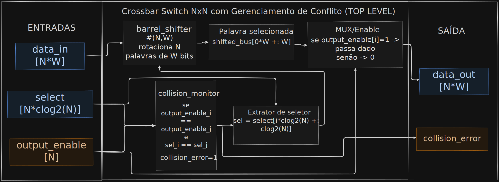
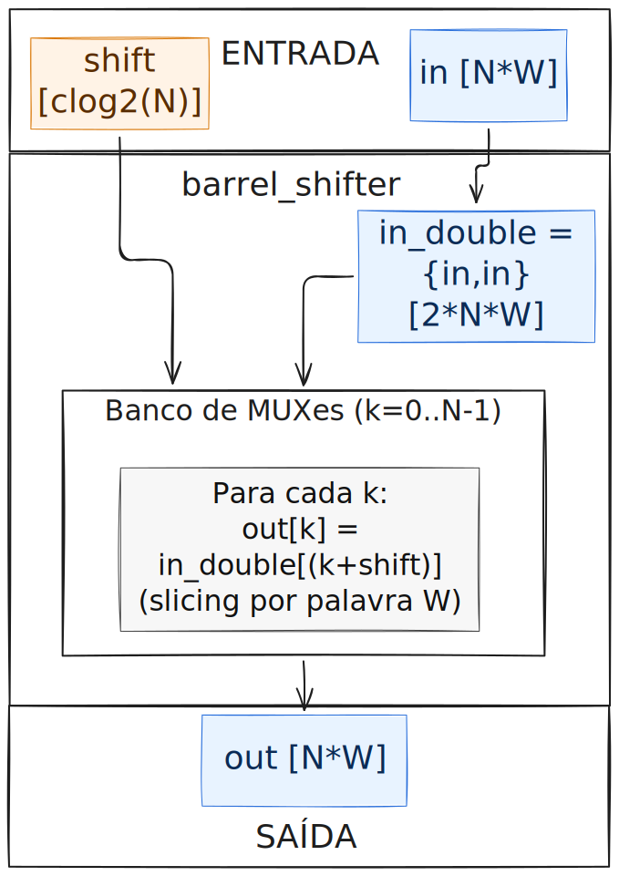
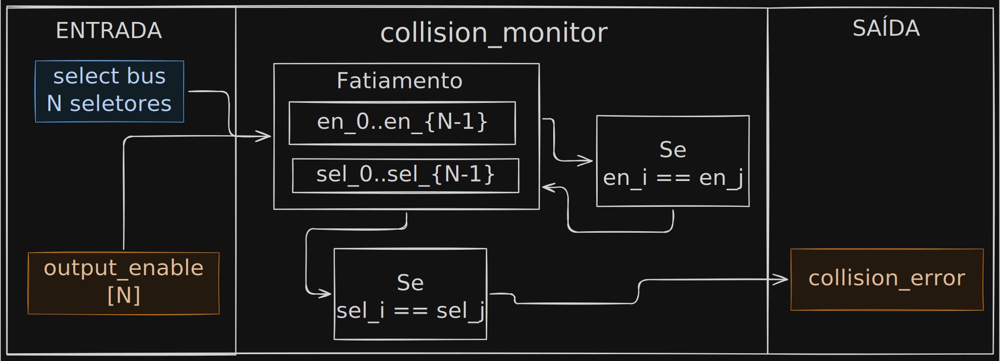

# Projeto Final - CrossbarNxN com Gerenciamento de Conflitos

### *Crossbar Switch NxN com Gerenciamento de Conflitos*

[Divisão do Grupo](https://www.notion.so/Divis-o-do-Grupo-30ceee1c1c76801c9567fa7fdaf6ab33?pvs=21) 

[Definições de Projeto](https://www.notion.so/30ceee1c1c768054b713c325fcba0b31?pvs=21) 

[Trab. Orientado - espec original](https://www.notion.so/Trab-Orientado-espec-original-30ceee1c1c7680e49978c1c2bf97b799?pvs=21) 

# Objetivo:

Projetar e implementar um comutador de matriz (Crossbar Switch) em Verilog que permita o roteamento independente e simultâneo de N portas. O projeto foca em escalabilidade de hardware (parametrização) e na implementação de lógica de monitoramento de integridade de tráfego. O sistema deve ser capaz de conectar qualquer uma das N entradas a qualquer uma das N saídas de forma paralela e sem bloqueio. A comutação interna deve ser baseada na arquitetura de Barrel Shifters para otimizar o deslocamento de barramentos de dados de largura W.

# Requisitos Técnicos

Para o sucesso da implementação, os seguintes requisitos devem ser atendidos:

- Parametrização Obrigatória: O design deve ser genérico, utilizando parameter para definir o número de portas (N) e a largura da palavra de dados (W). O hardware deve ser capaz de se reconfigurar automaticamente ao alterar esses valores.
- Seleção Independente por Saída: Cada porta de saída deve possuir seu próprio barramento de controle de seleção dedicado. Isso permite que múltiplas rotas distintas coexistam no mesmo ciclo de clock.
- Detecção de Colisão (collision_error): O hardware deve monitorar os sinais de seleção em tempo real. Caso dois ou mais seletores de saída apontem para a mesma porta de entrada simultaneamente, um sinal de status global de erro deve ser ativado.
- Habilitação de Saída (output_enable): Cada porta de saída deve possuir um sinal de controle individual. Se desativado, a saída correspondente deve ser forçada a zero para evitar a propagação de dados residuais.

# Arquitetura Modular

O código deve ser organizado de forma hierárquica nos seguintes blocos:

- Módulo Barrel Shifter:
    - Núcleo combinacional responsável pelo deslocamento e roteamento dos dados.
- Módulo de Monitoria:
    - Lógica de comparação responsável pela detecção de duplicidade nos seletores (Lógica de Colisão).
- Módulo Top-Level:
    - Integração final da matriz de comutação com os sinais de status, erro e habilitação.

# Entregáveis Detalhados

O grupo deve fornecer os seguintes itens para avaliação:

- [x]  Implementação Genérica:
    - [x]  Uso obrigatório de blocos generate ou laços for combinacionais.
    - [x]  O código deve ser validado para diferentes valores de N e W sem necessidade de reescrita da lógica interna.
- [x]  Testbench de Validação:
    - [x]  A simulação deve ser realizada configurando o módulo para uma instância de, no mínimo, N=8 (8 entradas e 8 saídas) e largura de dado W >= 8 bits. O grupo deve demonstrar:
        - [x]  Roteamento Paralelo de Alta Densidade:
            - [x]  Demonstração de pelo menos 4 rotas distintas e simultâneas (ex: Entrada 0 -> Saída 7, Entrada 1 -> Saída 6, etc.),
            - [x]  provando que não há interferência entre os barramentos de dados.
        - [x]  Validação de Conflito (Corner Case):
            - [x]  Forçar uma condição onde múltiplas saídas (ex: Saídas 0, 1 e 2) tentem acessar simultaneamente a mesma entrada.
            - [x]  O grupo deve validar a ativação imediata do sinal collision_error.
        - [x]  Controle de Habilitação:
            - [x]  Demonstração do sinal **enable** atuando em tempo real, garantindo que a saída seja zerada instantaneamente quando desabilitada, independentemente do dado na entrada.
        - [x]  Mudança Dinâmica:
            - [x]  Alterar a configuração de rota durante a transmissão de dados e observar a comutação correta no diagrama de tempos.
- [x]  Diagrama de Blocos:
    - [x]  Representação visual detalhada da arquitetura interna implementada e do fluxo de dados.

# Arquitetura:

https://excalidraw.com/#json=U3v6aLyHEkSc9oEpx_GAO,xqwJxPkm8C-Xie3GAvHaMQ

- Crossbar Swtich (toplevel - Dados),
- Barrelshifter (Controle),
- Collision Monitor (Monitoramento)

Crossbar Switch NxN - Top Level - Dados

Barrel Shifter - Controle

Collision Monitor - Monitoramento

### Desenvolvimento GitHub

- https://github.com/HyAgOsK/cidigital-crossbar-switch-nxn-conflict-manager